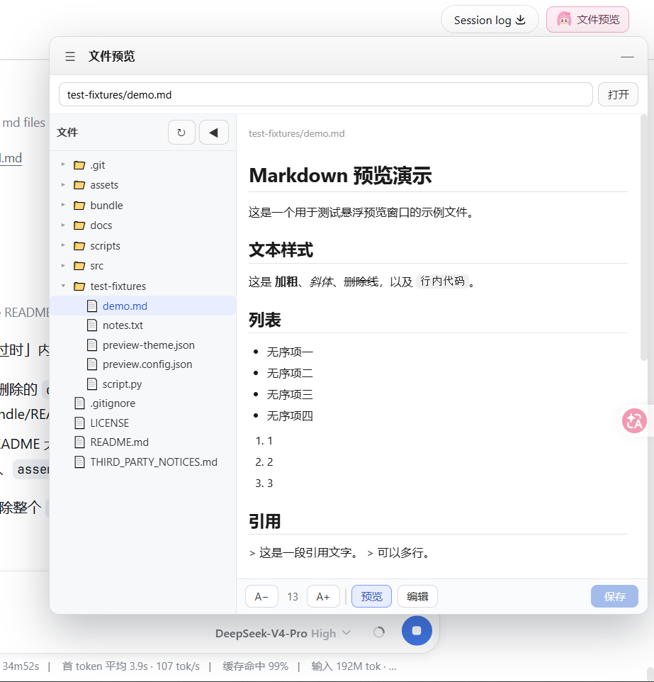
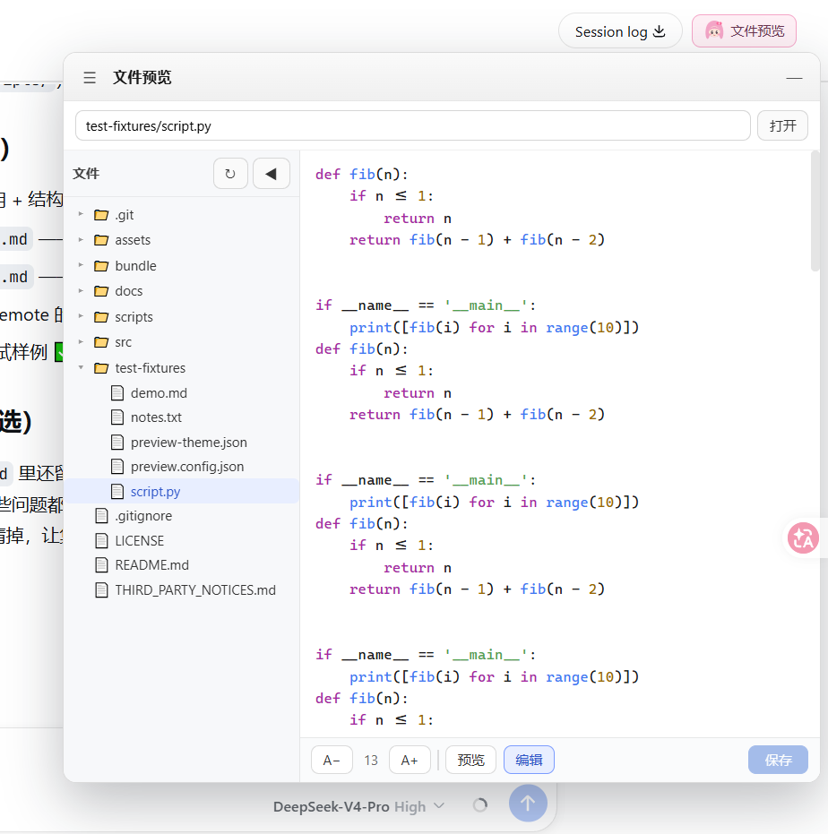

# file-peek 👀

> 昵称 `file-peek` · 正式仓库/npm 名 `dsh-file-preview`

<p align="center">
  
</p>

抱书女仆帮你偷瞄工作区 —— DeepSeek Harness 的「悬浮文件预览窗口」插件（宿主 Typert Remote 服务 + 浏览器客户端悬浮窗）。

已发布到 npm（作用域 `@undeadsheep`）：

- [`@undeadsheep/dsh-file-preview`](https://www.npmjs.com/package/@undeadsheep/dsh-file-preview) — 组合包（bundle）+ 宿主服务
- [`@undeadsheep/dsh-client-ui-file-preview`](https://www.npmjs.com/package/@undeadsheep/dsh-client-ui-file-preview) — 客户端 UI

用户安装：

```powershell
dsh plugin --profile web add @undeadsheep/dsh-file-preview
```

## 界面截图

<p align="center">
  
  &nbsp;&nbsp;
  
</p>

## 目录结构

```
├── src/
│   ├── host/          # 宿主 Remote 服务源码（从 fork 同步的快照）
│   └── client/        # 客户端 UI 源码（从 fork 同步的快照）
├── bundle/
│   ├── dsh-file-preview/              # 组合包（dsh.bundle + 宿主服务 + Typert 产物）
│   └── dsh-client-ui-file-preview/    # 客户端包（dsh.client + 浏览器 bundle）
├── scripts/
│   ├── assemble-bundle.ps1            # 从 fork 构建产物组装 + 改名 @undeadsheep/*
│   └── legacy/                        # 早期开发用的同步/修复脚本，仅存档
├── docs/
│   └── file-preview-INTEGRATION.md    # 集成到 monorepo 的说明
└── test-fixtures/                     # 悬浮窗测试样例文件
```

## 源码与构建的关系

- **`src/` 是源码快照**（只读参考），不是可独立构建的工程——它的 `tsconfig.json` 引用了 monorepo 的
  vendored 包，实际编译在 fork 里进行。
- **真正的源码与构建在 fork**：`UndeadSheep/deepseek-harness` 的 `feat/file-preview` 分支
  （`packages/workspace/file-preview` + `packages/client/ui-file-preview`）。
- 本仓库负责**分发打包与发布**：`scripts/assemble-bundle.ps1` 读取 fork 构建出的 `lib/`，组装成
  `bundle/` 里的两个可发布包，并把烘焙的包名从 `@deepseek-ai/*` 改成 `@undeadsheep/*`。

## 改代码 → 重打包 → 发布流程

1. 在 fork 里改源码并重新构建：

   ```powershell
   pnpm --filter @deepseek-ai/dsh-file-preview build
   pnpm --filter @deepseek-ai/dsh-client-ui-file-preview build
   ```

2. 重新组装（若 fork 不在默认路径，先 `$env:DSH_FORK = '<fork 路径>'`）：

   ```powershell
   & .\scripts\assemble-bundle.ps1
   ```

3. bump 版本号（npm 同一版本不能重复发）：两个 `bundle/*/package.json` 的 `version` 一起 bump，
   并把 `bundle/dsh-file-preview/package.json` 里对客户端的 `^0.1.0-rc.0` 依赖同步 bump。

4. 发布（先客户端后 bundle，prerelease 必须带 `--tag latest`）：

   ```powershell
   Set-Location .\bundle\dsh-client-ui-file-preview; npm publish --access public --tag latest
   Set-Location .\bundle\dsh-file-preview;        npm publish --access public --tag latest
   ```

## 已知限制

- **git 安装（`dsh plugin add github:...`）未实现**：当前只分发预构建产物（npm / tarball）。
  git 安装需要单包仓库 + 自包含 `prepare` 构建脚本。

## 作者与许可

- 作者：UndeadSheep
- 许可：[MIT](LICENSE) —— 可自由使用/修改/分发，但需保留本版权声明与署名。
- 第三方声明：[THIRD_PARTY_NOTICES.md](THIRD_PARTY_NOTICES.md) —— 构建产物内嵌了 zod（MIT）。
- 社区收录：本仓库添加 GitHub topic `dsh-plugin` 后，会被 [awesome-dsh-plugin](https://github.com/awesome-dsh-plugin/awesome-dsh-plugin)
  等社区列表与 topic 搜索收录。
