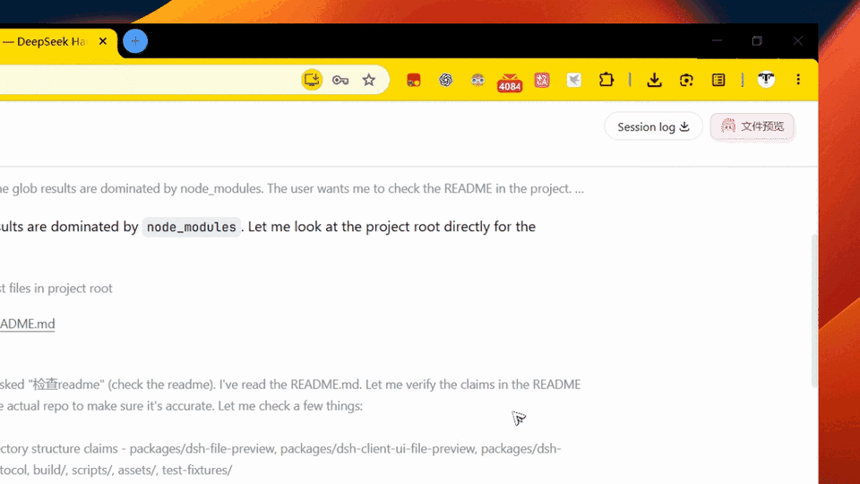
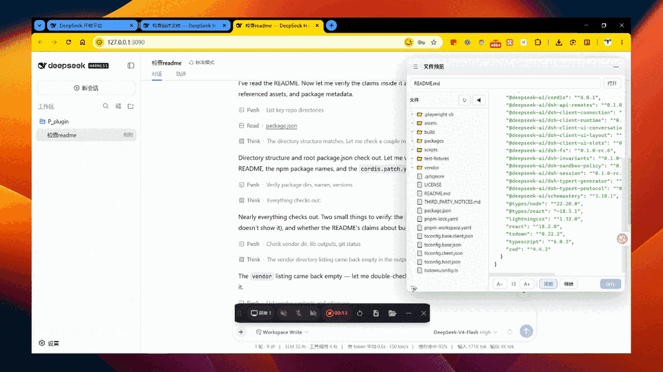
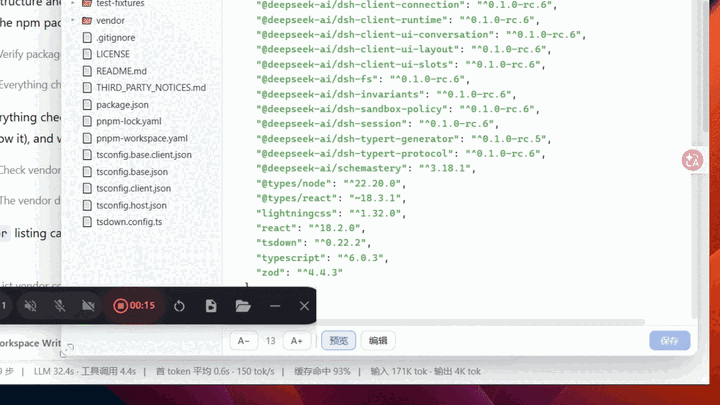
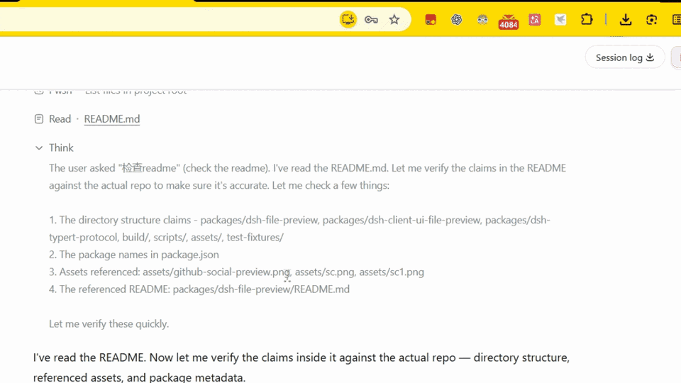
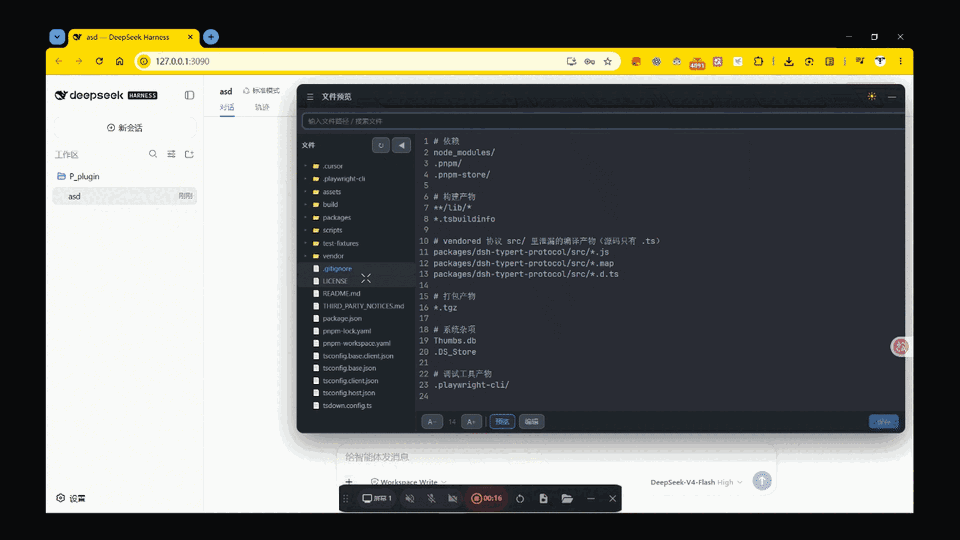
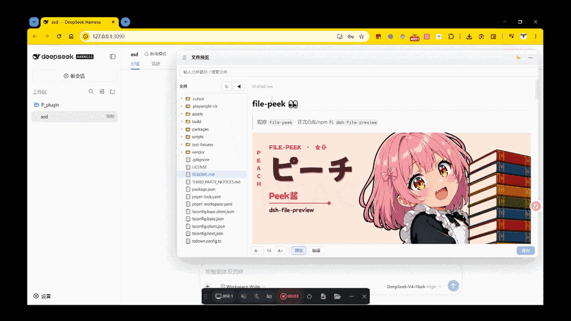

# file-peek 👀

[](https://awesome-dsh-plugin.com)
[](https://www.npmjs.com/package/@undeadsheep/dsh-file-preview)
[](LICENSE)

> 昵称 `file-peek` · 正式仓库/npm 名 `dsh-file-preview`


抱书女仆帮你偷瞄工作区 —— DeepSeek Harness 的「悬浮文件预览窗口」插件（宿主 Typert Remote 服务 + 浏览器客户端悬浮窗）。

## 功能演示

<table>
  <tr>
    <td align="center" width="50%">
      
      <br /><strong>一键唤出</strong>
      <br />会话头部按钮打开悬浮窗
    </td>
    <td align="center" width="50%">
      
      <br /><strong>可拖可改大小</strong>
      <br />可拖拽移动，拉动边缘调整悬浮窗宽高
    </td>
  </tr>
  <tr>
    <td align="center" width="50%">
      
      <br /><strong>预览也能改</strong>
      <br />切编辑，保存写回工作区
    </td>
    <td align="center" width="50%">
      
      <br /><strong>对话里偷瞄</strong>
      <br />点路径进预览，不唤系统打开
    </td>
  </tr>
  <tr>
    <td align="center" width="50%">
      
      <br /><strong>路径即搜</strong>
      <br />顶部输入框模糊搜索工作区文件
    </td>
    <td align="center" width="50%">
      
      <br /><strong>一键亮暗</strong>
      <br />标题栏切换浅色 / 深色
    </td>
  </tr>
</table>

## 安装

需要已安装 [DeepSeek Harness](https://github.com/deepseek-ai/deepseek-harness)，并用 **Web 客户端**（`--profile web`）。装宿主包即可，Web 客户端会一并装上。

```bash
dsh plugin --profile web add @undeadsheep/dsh-file-preview@0.1.1
dsh web
```

打开页面后，会话头部右上角应出现「文件预览」。点它即可打开悬浮窗。已在运行 `dsh web` 的，装完后重启一次。

当前请钉死 `0.1.1`：DSH 用的 pnpm 对刚发布的包有约 24 小时门禁，不写版本号或用 `@latest` 可能仍装到 `0.1.0`。满一天后改回不带版本号的 `add` 即可。

### 更新

已装过旧版的，钉版本并加 `--force`：

```bash
dsh plugin --profile web add @undeadsheep/dsh-file-preview@0.1.1 --force
```

改完同样重启 `dsh web`。想跟预发布：`add @undeadsheep/dsh-file-preview@next`。稳定用户不要用 `@next`。

### 卸载

```bash
dsh plugin --profile web remove @undeadsheep/dsh-file-preview
```

重启 `dsh web` 后按钮消失。

### 看不到按钮？

1. 确认重启过 `dsh web`（热加载不会挂上新插件）。
2. 确认加的是 `--profile web`，不要装进别的 profile。
3. 若用了自定义 `DSH_HOME`，安装和启动必须指向同一目录。

## 功能

- **悬浮预览窗口**：会话头部按钮唤出，可拖动、调大小、折叠侧边栏。
- **文件树**：按需逐层加载——首开只列工作区顶层，展开目录才读下一层；自动跳过 `node_modules` / `.git` / `.next` 等重目录，大仓库也秒开。
- **代码预览 + 编辑**：基于 **CodeMirror 6**（虚拟化渲染 + 增量解析），大文件流畅；切「编辑」可改文本并保存（`Ctrl+S`）。编辑态自带回车自动缩进、Tab 缩进、引号/括号自动闭合、撤销重做。
- **Markdown 渲染**：`react-markdown` + GFM（表格 / 任务列表 / 删除线），原生 HTML 经 `rehype-sanitize` 白名单过滤；本地相对路径图片自动内联预览；本地文件链接点击后在预览窗口内打开。
- **图片预览**：单独打开 `png/jpg/gif/webp/svg` 等图片（≤5MB），支持滚轮缩放、拖拽平移、适应窗口。
- **深色模式**：标题栏一键切换浅色 / 深色（One Dark 配色）。
- **内嵌 JetBrains Mono**：代码预览/编辑默认使用内嵌字体，用户无需本地安装。
- **Quick Open**：顶部输入框模糊搜索工作区文件（↑↓ 选择、命中高亮）、最近文件历史、清空按钮、内联错误提示。
- **会话文件直达**：点击会话里提到的文件路径，直接打开预览。
- **主题与配置**：工作区根目录放 `preview-theme.json` 自定义 8 种高亮色 + 背景/前景（缺省回退 `.vscode/settings.json`，再回退内置默认）；`preview.config.json` 可配缩进 / 字号 / 轮询间隔 / 字体。详见[宿主包 README](packages/dsh-file-preview/README.md)。

## 目录结构

```
├── packages/
│   ├── dsh-file-preview/              # 宿主：Typert Remote 服务 + 组合包清单
│   │   ├── src/                       #   宿主源码
│   │   ├── cordis.patch.yml           #   dsh.bundle 层（插入 file-preview + ui-file-preview 两行）
│   │   └── package.json / tsconfig.json
│   ├── dsh-client-ui-file-preview/    # 客户端：浏览器悬浮窗 UI
│   │   ├── src/                       #   客户端源码（含 CSS Module）
│   │   └── package.json / tsconfig.json / tsdown.config.ts
│   └── dsh-typert-protocol/           # vendor 的协议源码（仅构建期，让 typert 生成器识别 @Remote）
├── build/                             # vendor 的构建辅助（clientBundle 预设 + platform 清单）
├── tsconfig.{base,base.client,host,client}.json
├── tsdown.config.ts                   # 根构建（workspace 模式，跑 Typert 代码生成）
├── scripts/                           # dev.mjs 一键开发脚本
├── assets/  test-fixtures/
└── LICENSE / THIRD_PARTY_NOTICES.md
```

## 开发（本仓库即源码，可独立构建）

本仓库是**自包含的插件源码仓库**。装依赖并构建：

```powershell
pnpm install
pnpm build        # = build:host + build:client
```

构建流程（产物 `packages/*/lib/`）：

1. `tsc -b` 编译各包 `src/` → `lib/types/`（类型声明 + 编译 JS）。
2. `tsdown --env.DSH_BUILD_FACE host`：打包宿主 `lib/index.js`，并跑 Typert 代码生成，产出 `typert.host.js` + `typert.remote-client.js`。
3. `tsdown --env.DSH_BUILD_FACE client`：出浏览器 bundle `lib/client.js`（CSS Module 内联 + `__ModuleLoader__` 包装）。

## 本地验证（一键）

改完源码后，一条命令构建 + 打包 + 装进干净的 dsh profile 并自动起 `dsh web`（自动处理「测试形态」的客户端依赖）：

```powershell
pnpm dev
```

启动后浏览器访问 `http://127.0.0.1:3090` 看效果（Ctrl+C 停止）。换端口用 `pnpm dev --port 3091`；只想构建+安装、不自动起服务用 `pnpm dev --no-start`（会打印带 `DSH_HOME` 的手动启动命令）。

> 装好的 profile 在 `%TEMP%\dsh-dev-profile`；整个过程不改动仓库的「发布形态」，只在你本地临时切换。
>
> ⚠️ 手动起服务时必须带上同一个 `DSH_HOME`（见 `--no-start` 打印的命令），否则 `dsh web` 读的是 `~/.dsh`
> ——那里没有本插件，就会「看不到文件预览按钮」。

## 发布到 npm

1. bump 版本：两个 `packages/*/package.json` 的 `version` 一起改成同一个版本号（例如 `0.1.1`）。
2. 构建：`pnpm build`。
3. 发布（**先客户端后宿主**，因为宿主依赖客户端）：

   ```powershell
   Set-Location .\packages\dsh-client-ui-file-preview; pnpm publish --access public --tag latest
   Set-Location .\packages\dsh-file-preview;        pnpm publish --access public --tag latest
   ```

   > 用 `pnpm publish` 而不是 `npm publish`：宿主 `package.json` 里的客户端依赖写的是
   > `workspace:^`，`pnpm publish` 会自动把它转成 `^<version>` 再上传（本地 `pnpm pack`
   > 也是同样的转换）。发布后核对：
   >
   > ```powershell
   > npm view @undeadsheep/dsh-file-preview dependencies
   > ```
   >
   > 客户端依赖应是 `^<version>`，不能是 `workspace:^`。

**版本标签策略：**

- **稳定版**（`0.1.0`、`0.1.1`…）→ `--tag latest`（普通用户 `add <包名>` 默认拿到）。
- **预发布版**（`0.2.0-beta.1` 等）→ `--tag next`，**不要用 latest**：

  ```powershell
  pnpm publish --access public --tag next
  ```

  测试用户用 `add <包名>@next` 显式拉取，不影响普通用户的稳定版。

## 作者与许可

- 作者：UndeadSheep
- 许可：[MIT](LICENSE)。
- 第三方声明：[THIRD_PARTY_NOTICES.md](THIRD_PARTY_NOTICES.md)。
